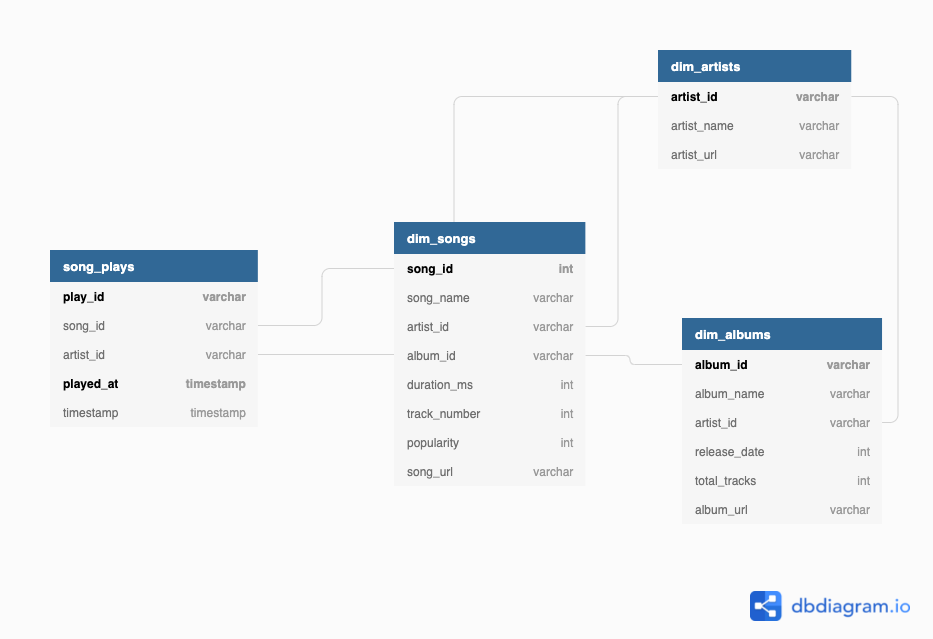

# Spotify ETL Job & Weekly Metrics Email

## I. Summary
This is a data engineering-focused project that performs an ETL job of my Spotify listening data and sends me an automated email of my weekly listening habits. The main project tools were Python, SQL, and Airflow.

For data extraction, this project utilizes the Spotipy Python library to connect to a Spotify API endpoint. I then performed data transformations using Pandas to build one fact table and three dimension tables that are compatible with a PostgreSQL database I modeled. Finally, used SQLAlchemy (ORM) and psycopg2 (Postgres driver) to load the data into staging tables for validation and then a "production" table for further ingestion.

Following the ETL job, I used Python (psycopg2, stmp, tabulate) and HTML/CSS to write an email with summary statistics on my weekly music-listening.

To automate and schedule these jobs, I utilized Airflow and built DAGs (directed acyclic graphs) to run a daily ETL job and a weekly email job.

## II. Tools
Python (Pandas, psycopg2, SQLAlchemy, stmp, Spotipy), SQL (Postgres), Airflow, HTML/CSS

## III. Extraction
For the data extraction process, I used the [Spotipy](https://spotipy.readthedocs.io/en/2.18.0/) Python library which allows for a smooth interaction with the Spotify Web API. Spotipy allows for an easy connection to the [Recently Played Tracks endpoint](https://developer.spotify.com/console/get-recently-played/) and bypasses any need for token refreshing (once a Spotify Developer App is configured).

Running the requests returns up to 50 songs (per daily request) in a nested dictionary structure. Following the API call, I parsed the raw data for the appropriate features and assembled them into four temporary dictionary structures (with nested lists) in accordance with a [Postgres database schema that I modeled](https://github.com/tsamba120/Spotify-ETL-Job-with-Airflow/blob/main/SQL/table_creation.sql). 

See "V. Loading to Database" for schema details.

## IV. Transformation & Data Validation
The temporary dictionaries from the previous step were then transformed into Pandas dataframes to be converted into staging tables. The four tables represent *unique listens* (fact), *songs* (dimension), *artists* (dimension), *albums* (dimension). 

The *unique listens* table *song_plays* consists of unique songs I listened to at any given time in the prior 24 hours. Because I cannot technically listen to two songs simultaneously, I set the table's primary key to be the timestamp column, *played_at*. This table also possesses foreign keys to dimension tables that provide further information on song name, artist name, and album name. 

## V. Loading Data to a PostgreSQL Database

## VI. Weekly Summary Email

## VII. Reflections & Plans for Future Improvement
